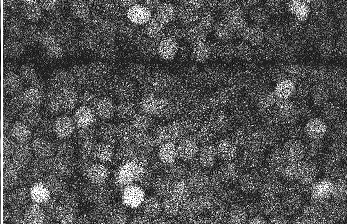
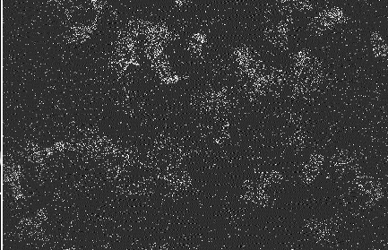

<!-- =======================================================
SINF: Learning Continuous Spatiotemporal Implicit Neural Fields
for Unsupervised Video Denoising
README.md
======================================================== -->

<div align="center">

# Learning Continuous Spatiotemporal Implicit Neural Fields for Unsupervised Video Denoising  


<!-- Badges (edit versions/venue/license if needed) -->
<p>
  
  
  
  
</p>

<!-- Optional "links" row (fill in when you have them) -->
<p>
  <b>Paper</b>: (HOLD) &nbsp;|&nbsp;
  <b>Project Page</b>: (HOLD) &nbsp;|&nbsp;
  <b>Video</b>: (HOLD) &nbsp;|&nbsp;
  <b>Poster</b>: (HOLD)
</p>

<!-- Optional teaser image placeholder -->
<!--  -->

</div>

---

## 🔥 Visual Results (GIF Demos)


<table>
  <tr>
    <th align="left" style="width:140px;">Dataset</th>
    <th align="center">Demo 1</th>
    <th align="center">Demo 2</th>
    <th align="center">Demo 3</th>
  </tr>

  <tr>
    <td><b>Synthetic noise</b></td>
    <td align="center"></td>
    <td align="center"></td>
    <td align="center"></td>
  </tr>

  <tr>
    <td><b>Real-world noise (Indoor)</b></td>
    <td align="center"></td>
    <td align="center"></td>
    <td align="center"></td>
  </tr>

  <tr>
    <td><b>Real-world noise (Outdoor)</b></td>
    <td align="center"></td>
    <td align="center"></td>
    <td align="center"></td>
  </tr>

  <tr>
    <td><b>Fluorescence imaging</b></td>
    <td align="center"></td>
    <td align="center"></td>
    <td align="center"></td>
  </tr>
</table>

---

## ✨ Highlights

- **Continuous spatiotemporal neural field**: models videos as samples from a *continuous* function over space–time, reducing discrete-frame artifacts and improving temporal coherence.
- **Truly unsupervised denoising**: learns directly from noisy sequences (**no paired clean targets**), remaining robust under complex, real-world noise statistics.
- **Motion-coherent refinement**: integrates motion cues to propagate information across frames, suppress flicker, and preserve fine details under large motions.
- **Field-driven interpretability & control**: the learned continuous field offers a principled view of how restoration evolves over time, enabling analysis and more stable refinement.

---

## 🧠 Method Overview

SINF treats a noisy video as observations of an underlying **continuous spatiotemporal signal** and learns a neural field that jointly achieves:

- **Local denoising without shortcuts** via blind-spot style supervision to prevent identity mapping.
- **Cross-frame information propagation** with motion-aware alignment to maintain temporal consistency.
- **Continuous-time regularization** to stabilize restoration trajectories and preserve high-frequency details.


---

## 🚀 Quickstart

### 1) Clone
```bash
git clone <YOUR_REPO_URL>
cd SINF
```

### 2) Setup environment
```bash
conda create -n sinf python=3.8 -y
conda activate sinf
pip install -r requirements.txt
```

### 3) Train (your current workflow)
```bash
cd train_models
python sRGB_train.py
```

---

## 🔧 Installation

### Requirements
- **Python**: 3.8+
- **PyTorch**: 1.10+ (CUDA recommended)
- **CUDA**: 11.3+ recommended
- **GPU**: NVIDIA GPU recommended for training

### Install
```bash
pip install -r requirements.txt
```


## 🗂 Data Preparation

### Supported datasets
- **Set8**
- **CRVD (Indoor/Outdoor)**
- **Fluorescence imaging**

### Recommended folder layout
You can organize the datasets in any way, as long as the dataset paths in scripts are correct.  
A typical layout is:

```text
data/
├── set8/
├── crvd/
│   ├── indoor/
│   └── outdoor/
└── fluorescence/
```

### Where to set paths
- Update dataset paths in: `train_models/sRGB_train.py`

---

## 🏋️ Training & Testing

### Train
```bash
cd train_models
python sRGB_train.py
```

### Common options
```bash
python sRGB_train.py \
  --GPU 0 \
  --epochs 300 \
  --batch_size 1 \
  --lr 1e-4 \
  --train_length 8 \
  --patch_size 144
```

### Resume training
If the script auto-resumes from a log directory, make sure you either:
- keep the same `log_dir` to resume, or
- change `log_dir` / delete old checkpoints to start from scratch.


## 📊 Evaluation

### Run evaluation
Use the repo’s provided testing script (recommended):
```bash
cd test_models
python sRGB_test.py --model_path /path/to/checkpoint.pth
```

---

## 📬 Contact

- Email: huxiaowan@buaa.edu.cn

---

## 📄 License

This project is released under the **MIT License**
